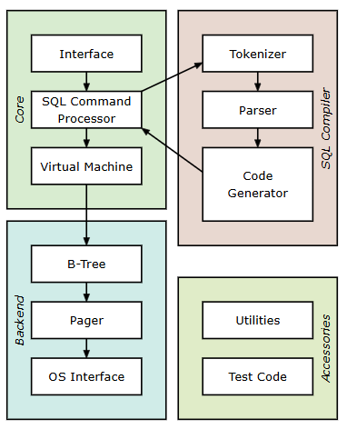

from the interface commands are taken 
which are then tokenized and parser which generated a code this goes to our virtual mation which sends to backend to process

its a little like what we learn in compiler design 

sudo apt install cmake
cd build
    to build(compile) the files and generating build files
cmake ..
    to generate build files
make
    to run the files
./minidb

